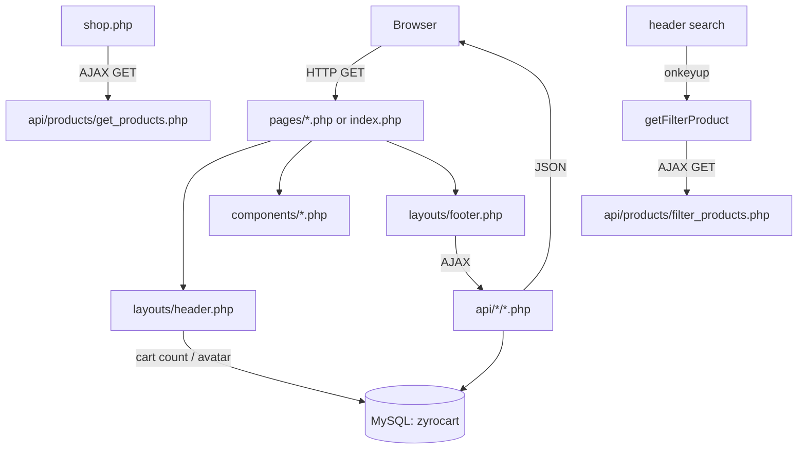

# 2. Architecture

ZyroCart follows a simple **include-based** page model — there is no router or framework. Each page assembles itself from shared layouts and components, and the browser calls a flat `api/` tree for dynamic data.

## Directory Structure

```
ecommerce-app/
├── index.php               # Homepage (root level, $base = '')
├── pages/                  # Sub-pages ($base = '../')
│   ├── shop.php  detail.php  cart.php  checkout.php
│   ├── login.php profile.php orders.php wishlist.php
│   └── addresses.php contact.php faqs.php help.php support.php
├── layouts/
│   ├── header.php          # Opens session, DB cart count, nav, search
│   └── footer.php          # Scripts + live search (getFilterProduct)
├── components/             # Reusable HTML fragments
│   ├── slider.php  featured.php  categories.php  offer.php
│   ├── trending-products.php  new-arrival.php  vendor.php  shop-slider.php
│   └── subscribe.php
├── api/                    # Procedural backend (JSON or redirect)
│   ├── config/db.php       # mysqli connection (zyrocart)
│   ├── database/database.sql
│   ├── auth/   (login, register, logout, update_profile,
│   │            delete_account, save_address, delete_address)
│   ├── cart/   (add_to_cart, update_cart, remove_cart)
│   └── products/ (get_products, product_detail, filter_products)
└── assets/                 # css, js, img, img2, lib, mail, scss
```

## Request Flow



## Key Patterns

### The `$base` Variable
Every page declares a base path so assets and links resolve from both root and sub-directories:

```php
<?php $base = '';        include 'layouts/header.php'; ?>   // index.php
<?php $base = '../';     include '../layouts/header.php'; ?> // pages/*.php
```
```html
<link href="<?php echo $base; ?>assets/css/style.css" rel="stylesheet">
```

### Dual Connection Anti-Pattern
`header.php` re-includes `api/config/db.php` when `$conn` is unset, but several pages (`shop.php`, `profile.php`, …) already `include` the DB file *after* the header — resulting in **two connections per request**. Centralizing the connection (see Roadmap) removes this.

### Mixed mysqli Styles
Some files use OOP (`$conn->prepare`, `$conn->query`); others use procedural (`mysqli_query`, `mysqli_prepare`). There is no shared data-access layer.
