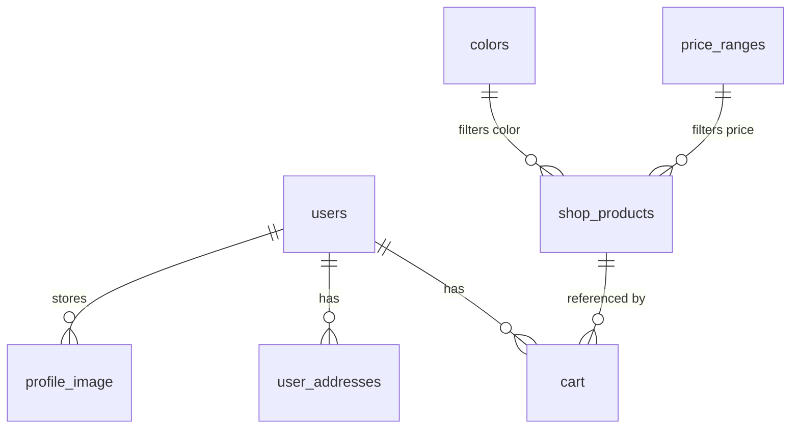

# 3. Data Model

The application expects the following tables. ⚠️ **The committed `api/database/database.sql` only defines `cart`.** The DDL below is reconstructed from how the code queries each table and should be committed as the canonical schema.

## Entity Relationships



## Tables

### `users`
```sql
CREATE TABLE users (
  id            INT AUTO_INCREMENT PRIMARY KEY,
  name          VARCHAR(120) NOT NULL,
  email         VARCHAR(160) NOT NULL UNIQUE,
  password      VARCHAR(255) NOT NULL,        -- bcrypt via password_hash()
  phone         VARCHAR(20)  DEFAULT NULL,
  profile_image VARCHAR(255) DEFAULT NULL,    -- filename in assets/img/users/
  created_at    TIMESTAMP DEFAULT CURRENT_TIMESTAMP
);
```

### `shop_products`
```sql
CREATE TABLE shop_products (
  id         INT AUTO_INCREMENT PRIMARY KEY,
  name       VARCHAR(255) NOT NULL,
  price      DECIMAL(10,2) NOT NULL,
  old_price  DECIMAL(10,2) DEFAULT NULL,
  category   VARCHAR(100) DEFAULT NULL,
  color_name VARCHAR(100) DEFAULT NULL,        -- joins colors.color_name
  image_url  TEXT,                             -- JSON array of image paths
  description TEXT
);
```

### `cart`
```sql
CREATE TABLE cart (
  id         INT AUTO_INCREMENT PRIMARY KEY,
  user_id    INT NOT NULL,
  product_id INT NOT NULL,
  quantity   INT DEFAULT 1,
  color      VARCHAR(50) DEFAULT NULL,
  size       VARCHAR(50) DEFAULT NULL,
  created_at TIMESTAMP DEFAULT CURRENT_TIMESTAMP
);
```

### `user_addresses`
```sql
CREATE TABLE user_addresses (
  id           INT AUTO_INCREMENT PRIMARY KEY,
  user_id      INT NOT NULL,
  name         VARCHAR(120),
  phone        VARCHAR(20),
  pincode      VARCHAR(10),
  locality     VARCHAR(160),
  full_address TEXT,
  city         VARCHAR(100),
  state        VARCHAR(100),
  address_type VARCHAR(20)
);
```

### `price_ranges`
```sql
CREATE TABLE price_ranges (
  id        INT AUTO_INCREMENT PRIMARY KEY,
  label     VARCHAR(80),
  min_price DECIMAL(10,2),
  max_price DECIMAL(10,2)
);
```

### `colors`
```sql
CREATE TABLE colors (
  id         INT AUTO_INCREMENT PRIMARY KEY,
  color_name VARCHAR(60) NOT NULL
);
```

## Known Schema Gaps

| Missing | Impact |
|---------|--------|
| `orders` table + API | "My Orders" page is a static empty state |
| `wishlist` table + API | "My Wishlist" page is a static empty state |
| Canonical migration file | `database.sql` covers only `cart`; other tables reverse-engineered |
| Foreign keys / indexes | None defined; relations are logical only |
